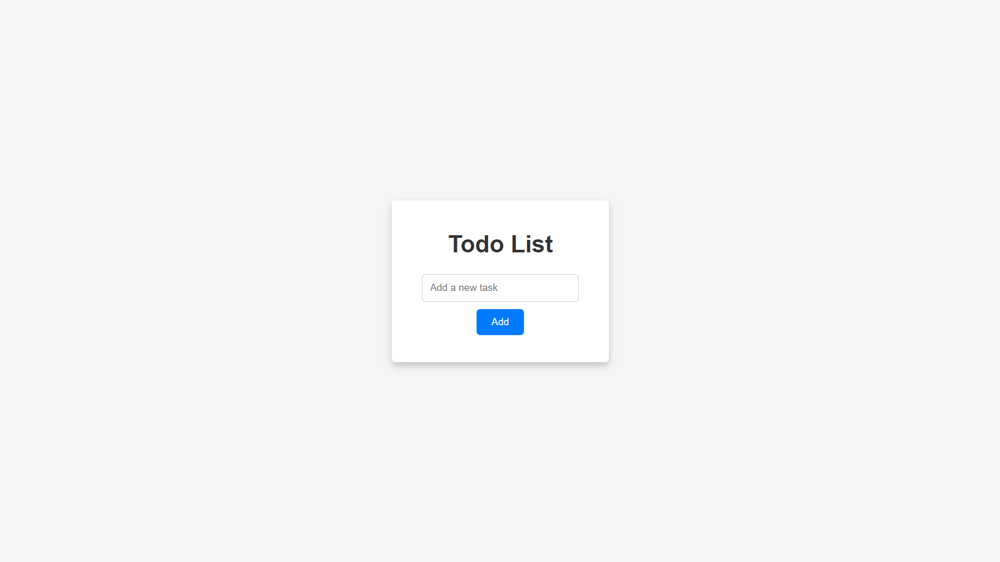
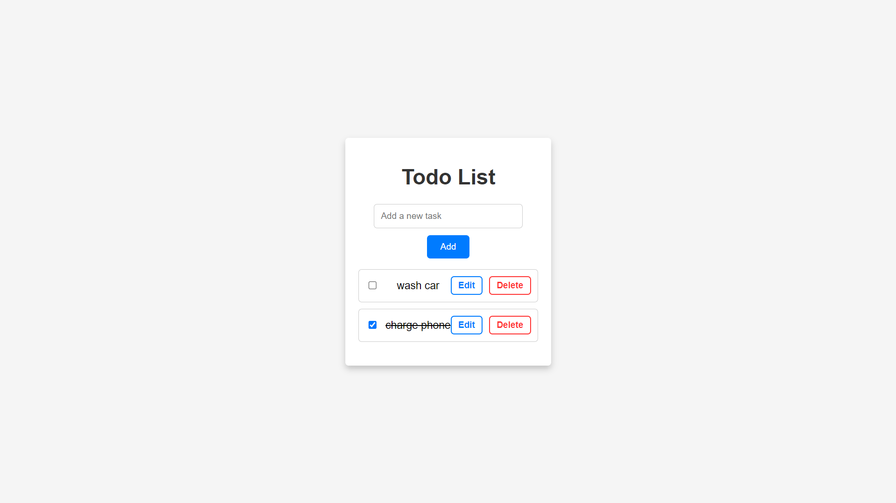

# Todo List App

## Description
This is a simple Todo List application that allows users to manage their tasks effectively. Built with HTML, CSS, and JavaScript, the app provides a clean and interactive interface to add, edit, delete, and mark tasks as completed.

## Features
- Add new tasks
- Edit existing tasks
- Delete tasks
- Mark tasks as completed
- Responsive design


Sure! Here’s an updated README with a Topics section to help categorize the main aspects of your project:

Updated README.md
markdown
Copy code
# Todo List App

## Description
This is a simple Todo List application that allows users to manage their tasks effectively. Built with HTML, CSS, and JavaScript, the app provides a clean and interactive interface to add, edit, delete, and mark tasks as completed.

## Features
- Add new tasks
- Edit existing tasks
- Delete tasks
- Mark tasks as completed
- Responsive design

## Topics
- **HTML**: Structure of the web application.
- **CSS**: Styling the application for a clean and modern look.
- **JavaScript**: Adding interactivity and dynamic features.
- **DOM Manipulation**: Creating and modifying HTML elements based on user input.
- **User Experience**: Focus on usability and accessibility.
  
## Screenshots

Below are some screenshots showing different stages of the app:

### 1. Initial Screen


### 2. Action Screen


## Getting Started

### Prerequisites
- A modern web browser (e.g., Chrome, Firefox, Safari)

### Installation
1. Clone the repository:
   ```bash
   git clone https://github.com/MoSalem149v2/ttodo-list-app_IBM-Task.git
